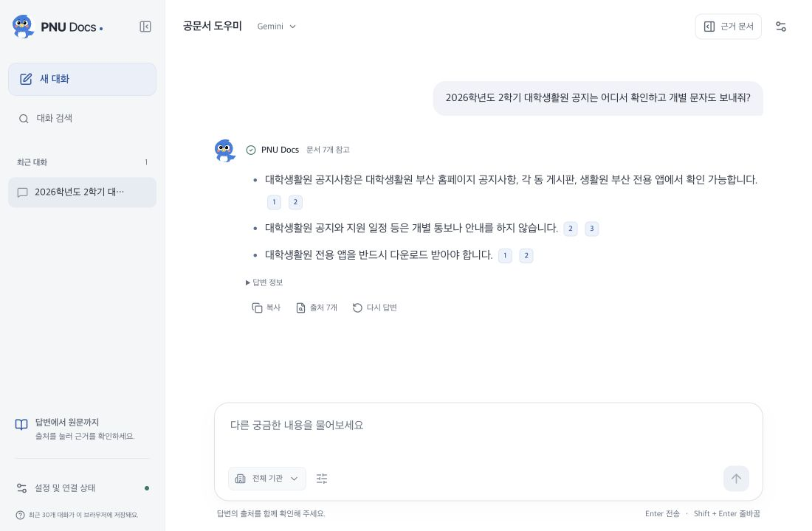
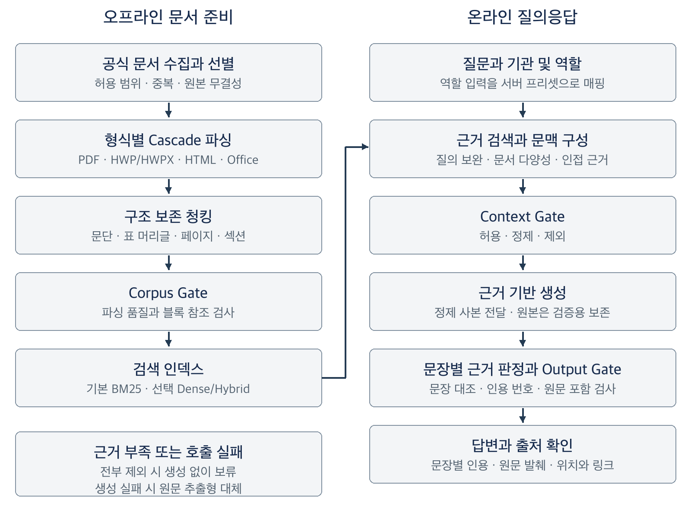
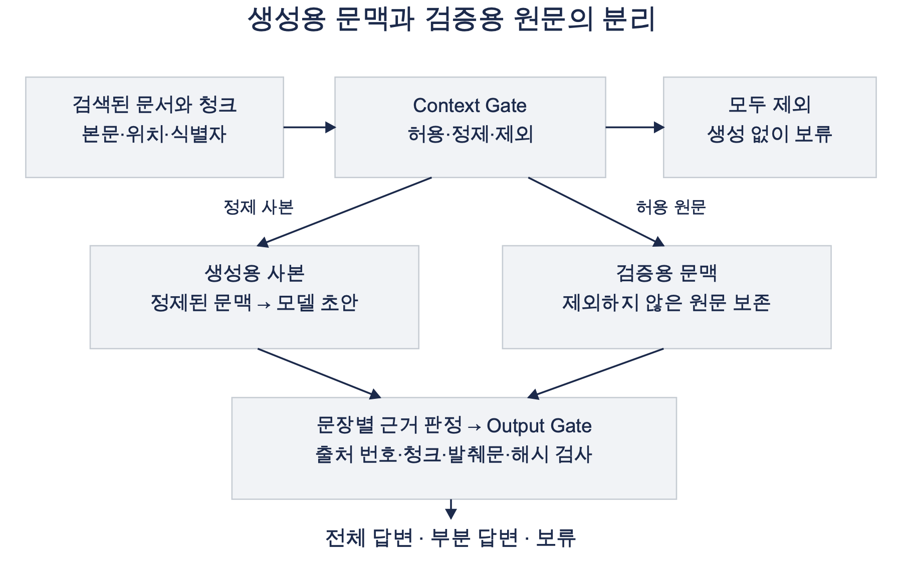
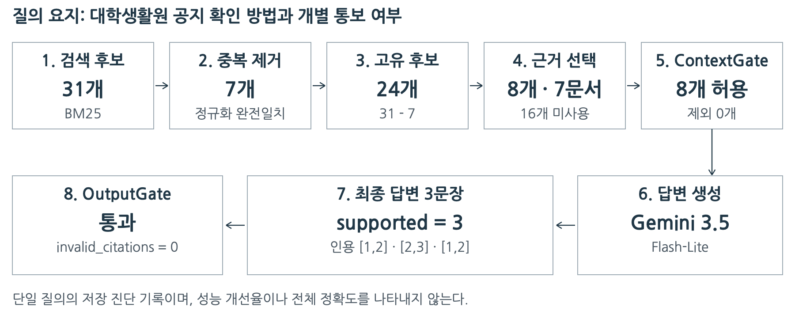
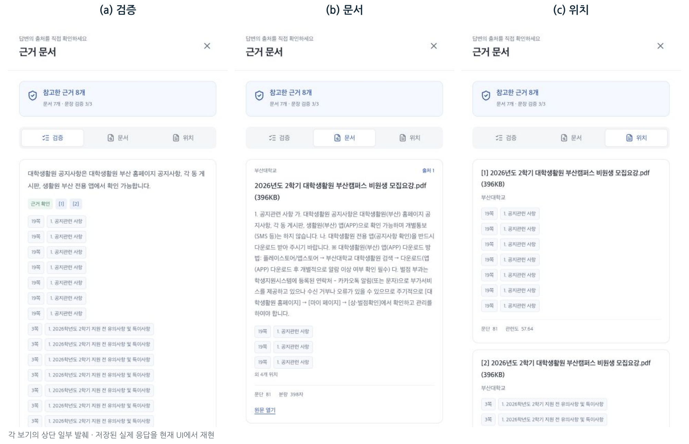

# 최신성, 정확성, 적대적 공격 대응을 적용한 부산대학교 및 공공기관 행정 문서 챗봇

> 2026년 전기 부산대학교 정보컴퓨터공학부 졸업과제 · 39조 **무엇이든물어보새** · 지도교수 손준영
>
> 서비스 화면 이름: **PNU Docs**



---

### 1. 프로젝트 배경

#### 1.1. 국내외 시장 현황 및 문제점

대학과 공공기관의 행정 정보는 부서별 홈페이지, 공지 게시판, 첨부파일(HWP·PDF·Office)에 흩어져 있습니다. 장학금 신청 자격이나 연구비 집행 절차처럼 한 가지를 확인하려 해도, 공지 본문에는 개요만 있고 신청 기간은 첨부 표에, 예외 조항은 별도의 규정이나 FAQ에 실려 있는 경우가 많습니다. 사용자는 여러 페이지를 옮겨 다니며 형식이 다른 파일을 직접 열어 내용을 연결해야 합니다.

생성형 AI 챗봇으로 이 문제를 풀려고 할 때에는 다음 네 가지 문제가 있습니다.

| 문제 | 내용 |
|---|---|
| 문서 형식의 불균일 | HTML, 텍스트 PDF, 스캔 PDF, HWP/HWPX, Office 문서는 글과 표를 추출하는 방법이 모두 다릅니다. 표의 행·열이 잘못 추출되면 금액과 대상, 날짜와 절차가 잘못 연결됩니다. |
| 검색 성공 ≠ 답변 성공 | 정답 문서를 찾아도 필요한 표 행이나 예외 조항이 모델에 전달되지 않으면 답변에서 빠집니다. 문서를 너무 많이 전달하면 다른 학년도의 조건이 섞입니다. |
| 근거 확인의 어려움 | 출처 목록만 붙이면 각 문장이 어느 자료에서 나왔는지 알 수 없습니다. 문서 안에 "이전 지시를 무시하라" 같은 공격 문구가 있으면 모델이 엉뚱한 답을 할 수도 있습니다. |
| 평가 결과의 해석 | 개발 중 반복해서 본 질문에서 성능이 좋아져도, 새로운 질문에서는 그렇지 않을 수 있습니다. |

#### 1.2. 필요성과 기대효과

- **필요성:** 행정 문서 질의응답에서는 답변이 자연스러운지보다 적용 대상, 시행 시점, 예외 조건이 정확한지가 더 중요합니다. 따라서 사용자가 답변의 근거를 원문에서 직접 확인할 수 있어야 합니다.
- **기대효과**
  - 학생·교직원·연구자가 여러 홈페이지와 첨부파일을 뒤지는 시간을 줄일 수 있습니다.
  - 답변의 각 문장에 출처 번호, 원문 발췌, 페이지·섹션 위치, 원문 링크가 붙어 있어서 사용자가 적용 범위를 스스로 판단할 수 있습니다.
  - 기관 메타데이터로 문서를 구분하므로 부산대학교 외의 공공기관 문서로 확장할 수 있습니다.

---

### 2. 개발 목표

#### 2.1. 목표 및 세부 내용

기관의 행정 문서를 검색하고, 사용자가 답변의 근거를 직접 확인할 수 있게 하는 것이 목표입니다.

| 구분 | 구현 목표 | 확인 방법 |
|---|---|---|
| 문서 처리 | 여러 형식의 문서를 공통 구조로 변환하고 위치 정보를 보존 | 수집·파싱 산출물과 파서 비교 |
| 근거 검색 | 관련 문서와 필요한 내용이 검색되도록 후보를 구성 | 문서 적중률·순위·지정 근거 회수율 |
| 답변 제공 | 문장별 인용과 원문 확인 수단을 제공 | 실제 생성 기록·서비스 화면 |
| 입력과 출력 검사 | 문서 속 공격 지시 및 잘못된 인용을 검사 | 합성 기능 시험·생성 포함 보안 파일럿 |
| 평가 재현성 | 질문·코드·응답·판정과 실행 조건을 연결 | 실험별 산출물·해시·집계 기록 |

대상 기관은 부산대학교, 금융감독원, 한국거래소, 한국예탁결제원, 한국은행, 한국인터넷진흥원(KISA), 한국해양과학기술원입니다. 정량 평가는 부산대학교 행정 문서를 대상으로 수행했습니다.

#### 2.2. 기존 서비스 대비 차별성

일반적인 문서 검색 챗봇과 비교했을 때, 이 프로젝트는 다음 기능을 갖추고 있습니다.

- **문장 단위 근거 표시:** 답변 전체에 출처 목록을 붙이지 않고, 문장마다 근거 번호를 붙입니다. 근거 문서 패널에서 "검증 · 문서 · 위치" 세 가지 보기로 원문 발췌와 페이지·섹션 위치를 확인할 수 있습니다.
- **형식별 파서 선택(Cascade 파싱):** HWP/HWPX, 텍스트 PDF, 스캔 PDF를 문서·페이지 품질에 따라 서로 다른 파서로 처리합니다. 결과는 공통 Block 구조로 정규화하고 표·섹션 구조를 보존합니다.
- **생성 전후 보안 검사:** 검색 문맥에 섞인 공격 지시를 생성 전에 걸러내는 Context Gate와, 답변의 인용이 원문과 맞는지 확인하는 Output Gate를 적용했습니다.
- **검색·생성·보안 단계의 분리 평가:** 개발용 질문(DEV45)과 개발에 사용하지 않은 holdout 질문을 나누어, 개선 효과가 새 질문에서도 유지되는지 확인했습니다.

> 외부 상용 챗봇에 같은 질문과 같은 채점 기준을 적용한 답변 성능 비교는 수행하지 않았습니다. 위 내용은 기능상의 차이이며 성능 우위를 뜻하지 않습니다.

#### 2.3. 사회적 가치 도입 계획

- **공공 정보 접근성:** 흩어진 행정 정보를 한곳에서 질문으로 찾을 수 있게 하여, 행정 절차에 익숙하지 않은 신입생·유학생·외부 연구자의 정보 격차를 줄입니다.
- **신뢰할 수 있는 AI:** 근거가 부족하면 답변을 보류하고, 모든 답변 문장에 원문 근거를 연결해 AI 답변을 그대로 믿지 않고 확인할 수 있게 합니다.
- **안전성:** 공식 문서라도 모델 지시로 취급하지 않고, 문서 속 공격 문구를 검사합니다.
- **지속 가능성:** 수집·파싱·색인 파이프라인을 재실행할 수 있도록 구성해 문서가 갱신되면 코퍼스를 다시 만들 수 있습니다. 로컬 LLM 경로를 지원하므로 외부 API 없이도 운영할 수 있습니다.

---

### 3. 시스템 설계

#### 3.1. 시스템 구성도

시스템은 **오프라인 문서 준비**와 **온라인 질의응답**으로 나뉩니다.



- **오프라인:** 공식 웹페이지와 첨부파일을 수집하고 범위·중복·무결성을 검사합니다. 형식별 파싱과 구조 보존 청킹을 거친 뒤, 품질 기준(Corpus Gate)을 통과한 결과로 검색 인덱스를 만듭니다.
- **온라인:** 질문과 기관·역할 설정을 받아 근거를 검색하고 문맥을 구성합니다. Context Gate로 문맥을 검사한 뒤 답변을 생성하고, 문장별 근거 판정과 Output Gate를 거쳐 최종 답변을 반환합니다.

생성 전후 보안 검사는 생성 모델에는 정제한 사본을 전달하고, 검증에는 원문을 사용하도록 분리했습니다.



#### 3.2. 사용 기술

| 계층 | 주요 기술 | 담당 기능 |
|---|---|---|
| 사용자 화면 | React 19 · TypeScript · Vite | 질문 작성, 답변·인용·원문 표시, 브라우저 대화 기록 |
| 질의 API | Python `ThreadingHTTPServer` · JSON | 기관·역할·검색·생성 설정을 받아 질문별 독립 요청 처리 |
| 검색 저장소 | SQLite · FTS5 BM25 | 청크·메타데이터 색인과 근거 검색. Dense(KURE, Snowflake Arctic)·Hybrid(RRF)는 선택 경로 |
| 문서 처리 | PyMuPDF · pdfplumber, Docling · PaddleOCR, hwplib · hwpxlib 등 | 파일 형식·페이지 특성·추출 품질에 따라 파서와 대체 경로 선택 |
| 답변 생성 | Gemini API · OpenAI 호환 로컬 서버(MLX-LM, Ollama) · 추출형 대체 | 공통 생성 계약으로 근거 전달, 실패 시 대체 처리 |
| 소프트웨어 검증 | Python unittest · Vitest · TypeScript · ESLint | 회귀 테스트, 타입 검사, 프론트엔드 100% 커버리지 검사와 빌드 |

---

### 4. 개발 결과

#### 4.1. 전체 시스템 흐름도

아래는 실제 질의 하나("대학생활원 공지 확인 방법과 개별 통보 여부")가 처리된 기록입니다. BM25 후보 31개에서 중복을 제거하고 근거 8개를 골라 답변을 만든 뒤, 문장 3개가 모두 근거로 지지되고 잘못된 인용이 0건임을 확인했습니다.



> 단일 질의의 저장 기록이며, 전체 정확도나 성능 개선율을 나타내지 않습니다.

#### 4.2. 기능 설명 및 주요 기능 명세서

| 기능 | 입력 | 출력 | 설명 |
|---|---|---|---|
| 문서 수집 | 기관 홈페이지 URL, 수집 범위 설정 | HTML·첨부파일, 수집 manifest | 허용 도메인·경로 안에서 본문과 첨부파일을 재개 가능하게 수집하고 원본 해시를 기록 |
| 코퍼스 선별 | 수집 manifest | 선별 manifest | 중복·범위 밖 문서를 제외하고 원본 추적 정보를 유지 |
| 문서 파싱·청킹 | PDF, HWP/HWPX, HTML, Office | 공통 Block, 청크 JSONL | Baseline·Challenger·Cascade 3개 프로필로 파싱하고 표·섹션·페이지 위치를 보존 |
| 검색 인덱스 | 청크 JSONL | SQLite FTS5 인덱스, Dense 행렬 | BM25 기본 인덱스와 선택형 학습 Dense 인덱스 생성 |
| 근거 검색 | 질문, 기관, 역할, 검색 범위(4·8·12개) | 근거 후보와 점수 | 문서 다양성 보장, 복합 질문의 누락 근거 보완, 역할별 기관 우선순위 반영 |
| 답변 생성 | 질문, 검사한 문맥 | 인용이 붙은 답변 | Gemini / 로컬 LLM / 자동 선택, 실패 시 원문 추출형 답변으로 대체 |
| 보안 검사 | 검색 문맥, 생성 초안 | 허용·정제·제외 판정, 인용 검증 결과 | Context Gate(생성 전)와 Output Gate(생성 후) |
| 근거 확인 UI | 답변 | 검증·문서·위치 보기 | 문장별 근거 판정, 원문 발췌, 페이지·섹션 위치, 원문·첨부 링크 |
| 대화 관리 | 사용자 조작 | 브라우저 저장 대화 | 최근 30개 대화 저장·검색·복원, 삭제 되돌리기, 요청 취소·재시도 |



**주요 결과** (자세한 조건과 해석은 [최종보고서](docs/01.보고서/03.최종보고서.pdf) 4장 참고)

- **코퍼스:** 부산대학교 선별 문서 2,260건 중 2,247건을 파싱하고, 품질 검사를 통과한 청크 44,520개로 검색 인덱스를 구성했습니다.
- **검색:** 개발용 45문항(DEV45)에서 BM25 검색 조정 후 문서 Hit@5가 64.4%에서 88.9%로 24.4%p 올랐습니다.
- **생성:** 같은 45문항의 반복 생성 비교에서 0~2점 평균이 0.88에서 1.21로 올랐습니다. 다만 완전 정답 문항 수의 증가는 통계적으로 유의하지 않았습니다.
- **보안:** 공격 변형 10개에서 최종 표식 출력이 보안 적용 전 1건, 보안 적용 후 0건이었습니다. 소규모 합성 공격에서 동작 차이를 확인한 결과이며, 일반적인 방어율을 뜻하지 않습니다.
- **최종 holdout 평가:** 개발에 사용하지 않은 36문항 중 핵심 27문항에서 완전정답률은 C0 23.5%, C1 22.2%로, 개발셋에서 본 검색 조정 효과가 재현되지 않았습니다. 필요한 근거 문서는 검색 후보 단계에서 모두 회수되었으므로, 병목은 검색이 아니라 생성·출력 검사 단계의 누락으로 분석했습니다.

#### 4.3. 디렉토리 구조

```text
.
├─ src/                    # React 채팅 UI
│  ├─ App.tsx              # 화면 조립과 요청 상태 관리
│  ├─ components/          # 메시지, 설정, 근거 문서 패널 등 UI 컴포넌트
│  ├─ chat/                # 상수, 표시 형식, 모델 선택 로직
│  ├─ state/, hooks/       # 대화 목록 저장·복원
│  └─ api/                 # RAG API 클라이언트와 응답 타입
├─ scripts/                # 서비스 런타임, 코퍼스 파이프라인, 평가 스크립트
│  ├─ search_api.py        # RAG API 서버
│  ├─ bm25_search.py       # BM25 / Dense 인덱스 생성과 검색
│  ├─ local_model_runtime.py # 로컬 MLX 모델 서버 수명 주기 관리
│  ├─ rag/                 # 검색 결합, 생성기, 역할 라우팅, 응답 계약
│  ├─ crawl_pnu_site.py    # 부산대 본문·첨부파일 크롤러
│  ├─ curate_pnu_corpus.py, derive_curated_run.py # 서비스 코퍼스 선별
│  ├─ parse_pipeline.py    # 3개 파서 프로필 실행·진단·검증 CLI
│  ├─ document_parsing/    # 공통 Block 스키마, 파서 어댑터, 품질·출력 계층
│  ├─ build_learned_dense_index.py # 학습 Dense 인덱스 생성
│  └─ analyze_*, evaluate_*, judge_*, build_*, run_final_* # 평가·채점·분석 (최종보고서 수치 재현용)
├─ parser-workers/         # Java HWP/HWPX, Docling, Paddle 격리 worker
├─ tests/                  # Python 단위 테스트 (tests/frontend/ 는 Vitest)
├─ config/                 # 평가 질문 세트, 크롤링 범위, 파서 아티팩트 버전
├─ evidence/               # 최종보고서가 인용하는 고정 평가 기록
├─ requirements/           # 파서·임베딩 런타임별 고정 버전 의존성
└─ docs/
   ├─ 01.보고서/           # 착수·중간·최종 보고서
   ├─ 02.포스터/
   ├─ 03.발표자료/
   ├─ DEVELOPMENT.md       # 크롤링·파싱·인덱스·API 상세 실행 방법
   ├─ professor-demo.md    # 시연 절차
   ├─ evaluation-protocol-20260914.md # 평가 프로토콜
   └─ archive/             # 날짜별 작업 기록과 중간 실험 보고서
```

#### 4.4. 산업체 멘토링 의견 및 반영 사항

| 멘토 | 의견 | 반영 사항 |
|---|---|---|
| 한국해양과학기술원 김대선 (2026.07.28 서면 자문) | 입력·출력 검사와 별개로, 운영 단계에서 문제가 생겼을 때 서비스를 멈추고 복구하는 비상정지·복구 절차가 필요함 | 사용자 화면에서 진행 중인 요청을 취소하는 기능을 제공합니다. 관리자용 비상정지(신규 요청 차단·대기 작업 취소·상태 확인 후 재개)와 복구 절차는 최종보고서 5.2절에 향후 과제로 정리했습니다. |

---

### 5. 설치 및 실행 방법

#### 5.1. 설치절차 및 실행 방법

**요구 사항**

- macOS 또는 Linux, Python 3.9 이상, Node.js 24 LTS, [Bun](https://bun.sh) (또는 npm)
- 답변 생성에 Gemini를 사용하려면 Gemini API 키가 필요합니다. 키가 없으면 원문 추출형 답변으로 동작합니다.

**1) 저장소와 의존성 설치**

```bash
git clone <this-repository-url>
cd <repository>
bun install                     # 또는 npm install
python3 -m pip install -r requirements.txt
```

**2) 환경변수 설정**

```bash
cp .env.example .env
# .env 에 GEMINI_API_KEY 를 입력합니다.
```

**3) 검색 인덱스 준비**

원문 문서와 검색 인덱스(`processed/`)는 용량 때문에 저장소에 포함하지 않았습니다. 문서 수집 → 선별 → 파싱 → 인덱스 생성 순서로 직접 만들어야 하며, 수집·파싱 명령은 [docs/DEVELOPMENT.md](docs/DEVELOPMENT.md)의 "부산대학교 홈페이지 크롤링"과 "데이터 파이프라인" 절에 정리되어 있습니다.

파싱이 끝나면 7개 기관의 결과를 하나의 서비스 인덱스로 합칩니다. 아직 파싱하지 않은 기관은 건너뛰므로, 기관을 추가로 파싱한 뒤 다시 실행하면 됩니다.

```bash
scripts/build_multi_institution_index.sh   # → processed/index/multi-institution.sqlite
```

| 기관 | 파서 프로필 | 청크 수 | 비고 |
|---|---|---:|---|
| 금융감독원 | Baseline | 174,199 | 원본 2.6GB |
| 한국은행 | Cascade | 47,715 | |
| 부산대학교 | Cascade | 44,520 | 선별 문서 2,247건. 최종보고서 평가에 사용한 것과 같은 청크 |
| 한국거래소 | Cascade | 27,365 | |
| 한국해양과학기술원 | Cascade | 5,772 | |
| 한국인터넷진흥원(KISA) | Cascade | 2,803 | |
| 한국예탁결제원 | Cascade | 231 | 원본 14건 |

금융감독원은 원본이 커서 스캔 PDF의 구조 분석·OCR(Docling, PaddleOCR)을 거치지 않는 Baseline으로 처리했습니다. 따라서 스캔 문서와 복잡한 표의 추출 품질이 낮을 수 있고, 일부 PDF는 띄어쓰기가 빠진 채 추출되었습니다. 한국거래소·한국예탁결제원·한국해양과학기술원은 Baseline 결과(`config/multi-institution-parse/baseline-*.jsonl`)도 함께 만들어 두었으며, 빌드 스크립트는 세 기관의 Cascade 결과가 모두 있을 때만 Cascade를 사용합니다.

**4) API 서버 실행** (터미널 1, 포트 8000)

```bash
python3 scripts/search_api.py --host 127.0.0.1 --port 8000 --env-file .env \
  --index processed/index/multi-institution.sqlite \
  --profile-index cascade=processed/index/multi-institution.sqlite \
  --default-parser-profile cascade \
  --dense-index processed/index/bm25-only.demo-disabled
curl -s http://127.0.0.1:8000/health   # "ready": true 확인
```

여러 파싱 결과를 합친 인덱스에는 파서 프로필 정보가 없으므로 `--profile-index cascade=…`로 지정합니다. `--dense-index`에는 존재하지 않는 경로를 주어 BM25만 사용합니다.

> **평가 결과와의 관계:** 최종보고서의 검색·생성 평가는 부산대학교 문서만 담은 인덱스(`pnu-20260725-curated-cascade-v5-allow-suspect.sqlite`)로 측정했습니다. BM25는 단어 가중치를 인덱스 전체 기준으로 계산하므로, 다른 기관 문서를 합친 인덱스에서는 같은 부산대 질문이라도 검색 순위가 달라질 수 있습니다. 보고서 수치를 재현하려면 [docs/professor-demo.md](docs/professor-demo.md)의 부산대 전용 실행 명령을 사용하세요.

**5) 프론트엔드 실행** (터미널 2, 포트 5173)

```bash
bun run dev -- --host 127.0.0.1
```

브라우저에서 <http://127.0.0.1:5173> 에 접속합니다. 시연에 사용한 3개 파서 프로필 동시 실행 설정은 [docs/professor-demo.md](docs/professor-demo.md)를 참고하세요.

**테스트**

```bash
bun run check           # Python 단위 테스트, ESLint, 타입 검사, 프론트엔드 100% 커버리지, 빌드
bun run test:coverage   # 프론트엔드 테스트와 커버리지만 실행
```

> 새로 clone한 저장소에서는 Python 테스트 2개(`test_shadow_testset`, `test_evidence_binding_experiment`의 원본 재현 테스트)가 실패합니다. 이 테스트들은 Git에 포함하지 않은 `processed/`의 평가 인덱스·패킷을 읽기 때문입니다. 두 테스트 파일은 평가 기록에 SHA가 고정되어 있어서 수정하지 않았습니다. 이 경우 `bun run check`는 Python 단계에서 멈추므로, 프론트엔드는 `bun run test:coverage`로 따로 검사할 수 있습니다.

#### 5.2. 오류 발생 시 해결 방법

| 증상 | 원인과 해결 방법 |
|---|---|
| 화면에 "검색 서비스 연결 상태"가 준비되지 않음으로 표시됨 | API 서버가 꺼져 있거나 인덱스 경로가 잘못되었습니다. `curl http://127.0.0.1:8000/health`에서 `ready`와 `chunk_count`를 확인하고, `--index` 경로를 실제 인덱스 파일로 지정합니다. |
| 브라우저 콘솔에 CORS 오류 또는 API가 403 `origin_not_allowed` 반환 | `.env`의 `RAG_ALLOWED_ORIGINS`에 프론트엔드 주소(예: `http://127.0.0.1:5173`)를 추가합니다. |
| 답변이 원문 발췌 형태로만 나옴 | Gemini 호출이 실패해 추출형 대체 답변이 사용된 것입니다. `.env`의 `GEMINI_API_KEY`와 네트워크를 확인합니다. |
| 로컬 모델 선택 시 8080 포트 충돌 | 이전에 등록한 MLX 서버가 포트를 쓰고 있습니다. [docs/DEVELOPMENT.md](docs/DEVELOPMENT.md)의 "로컬 모델 서버 실행" 절을 참고해 기존 프로세스를 종료합니다. |
| Dense·Hybrid 검색 방식이 선택되지 않음 | 학습 Dense 인덱스가 없거나 BM25 인덱스와 corpus revision이 다릅니다. BM25로 사용하거나 `scripts/build_learned_dense_index.py`로 인덱스를 다시 만듭니다. |
| `/search`, `/chat` 요청이 401 | `.env`에 `RAG_API_TOKEN`을 설정한 경우 프론트엔드의 `VITE_RAG_API_TOKEN`에도 같은 값을 넣습니다. |

---

### 6. 소개 자료 및 시연 영상

#### 6.1. 프로젝트 소개 자료

- [포스터](docs/02.포스터/포스터.pdf)
- [착수보고서](docs/01.보고서/01.착수보고서.pdf)
- [중간보고서](docs/01.보고서/02.중간보고서.pdf)
- [최종보고서](docs/01.보고서/03.최종보고서.pdf)
- [발표자료](docs/03.발표자료/발표자료.pptx)

#### 6.2. 시연 영상

<!-- 정보컴퓨터공학부 YouTube 채널 업로드 후 아래 {동영상 ID} 를 교체하세요. (9.30. 까지) -->
[](https://www.youtube.com/watch?v={동영상 ID})

---

### 7. 팀 구성

#### 7.1. 팀원별 소개 및 역할 분담

| 이름 | 학번 | 연락처 | 주담당 업무 |
|---|---|---|---|
| 이현우 (팀장) | 202155596 | kodokugourmet@gmail.com | 문서 수집·파싱·검색·답변 생성 파이프라인 설계<br>답변 정확성·근거 일치 평가용 LLM Judge 설계·실험<br>BM25 RAG API 구현, React 연동 및 배포 |
| 황지완 | 202155627 | hjw8486@pusan.ac.kr | 문서 파싱·RAG·평가 방법 관련 논문 조사 및 비교<br>대학·공공기관 문서 수집, HWP/PDF 파싱 및 청킹<br>문서 최신성 확인 및 적대적 공격 평가 |
| 정지인 | 202355709 | gini202355709@gmail.com | 생성 전 문맥 검사·생성 후 인용 검증 보안 레이어 탑재<br>RAG·보안 벤치마크 조사, 평가셋과 실험 조건 설계<br>출처 검증 UI/UX 구성 및 보고서·발표 자료 정리 |

검색·리랭킹·생성 모델의 병렬 실험과 비교는 팀 공통 업무로 수행했습니다.

#### 7.2. 팀원 별 참여 후기

- **이현우:** 졸업과제를 통해 기획과 설계부터 구현, 트러블슈팅까지 전 과정을 직접 맡아 보며 팀원들과 협업할 수 있어 좋았습니다. 또한 문제를 해결하기 위해 다양한 자료를 찾아보고 적용하는 과정에서 스스로의 역량을 키울 수 있었습니다.
- **황지완:** 그동안 배운 전공지식을 졸업과제를 통해 직접 적용해 볼 수 있었던 시간이 된 것 같습니다. 함께 고생한 팀원들에게 감사하며, 덕분에 잘 마무리할 수 있었습니다.
- **정지인:** 졸업과제를 진행하며 기획부터 구현, 문제 해결까지 전 과정을 직접 경험할 수 있어 의미 있었습니다. 팀원들과 협업하며 실제 프로젝트를 완성해 나가는 과정에서 전공 지식뿐 아니라 소통과 협업의 중요성도 배울 수 있었습니다.

---

### 8. 참고 문헌 및 출처

1. P. Lewis et al., "Retrieval-Augmented Generation for Knowledge-Intensive NLP Tasks," *NeurIPS*, vol. 33, 2020.
2. S. Robertson and H. Zaragoza, "The Probabilistic Relevance Framework: BM25 and Beyond," *Foundations and Trends in Information Retrieval*, 3(4):333–389, 2009. <https://doi.org/10.1561/1500000019>
3. V. Karpukhin et al., "Dense Passage Retrieval for Open-Domain Question Answering," *EMNLP*, pp. 6769–6781, 2020. <https://doi.org/10.18653/v1/2020.emnlp-main.550>
4. G. V. Cormack, C. L. A. Clarke, and S. Büttcher, "Reciprocal Rank Fusion Outperforms Condorcet and Individual Rank Learning Methods," *SIGIR*, 2009.
5. N. F. Liu et al., "Lost in the Middle: How Language Models Use Long Contexts," *TACL*, 12:157–173, 2024. <https://doi.org/10.1162/tacl_a_00638>
6. S. Es, J. James, L. Espinosa-Anke, and S. Schockaert, "RAGAs: Automated Evaluation of Retrieval Augmented Generation," *EACL System Demonstrations*, pp. 150–158, 2024. <https://doi.org/10.18653/v1/2024.eacl-demo.16>
7. L. Zheng et al., "Judging LLM-as-a-Judge with MT-Bench and Chatbot Arena," *NeurIPS*, vol. 36, 2023.
8. F. Perez and I. Ribeiro, "Ignore Previous Prompt: Attack Techniques For Language Models," *NeurIPS ML Safety Workshop*, 2022. <https://doi.org/10.48550/arXiv.2211.09527>
9. K. Greshake et al., "Not What You've Signed Up For: Compromising Real-World LLM-Integrated Applications with Indirect Prompt Injection," arXiv:2302.12173, 2023. <https://doi.org/10.48550/arXiv.2302.12173>
10. 김대선, 「2026 정보컴퓨터공학부 졸업과제 서면 자문 보고서」, 한국해양과학기술원, 2026.07.28.
11. 검색 대상 문서: 부산대학교, 금융감독원, 한국거래소, 한국예탁결제원, 한국은행, 한국인터넷진흥원, 한국해양과학기술원의 공식 홈페이지 공지·규정·첨부파일 (2026년 6~7월 수집). 저작권은 각 기관에 있으며, 원문은 저장소에 포함하지 않았습니다.
